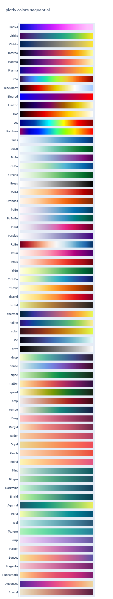
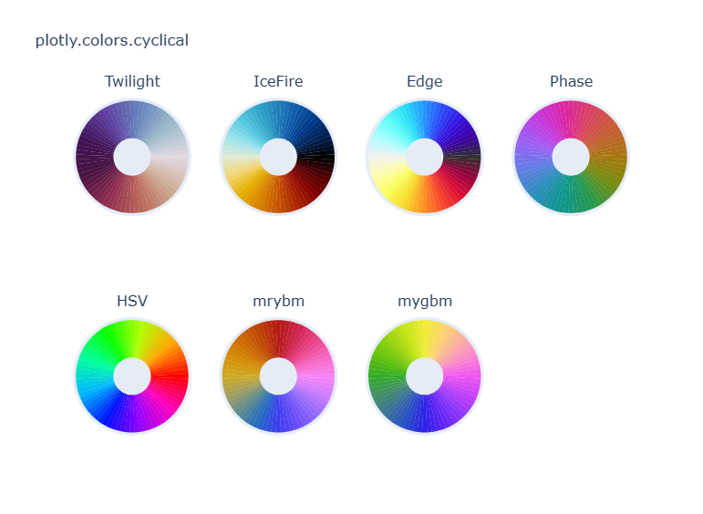
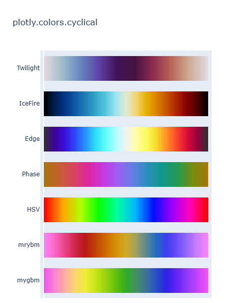

# 内置 colorscale

2023-05-19
****
## 简介

下面介绍 plotly 提供的内置命名连续 colorscale，分为顺序（sequential）、发散（diverging）和循环（cyclical）三种类型。

px 函数的 `color_continuous_scale` 参数和 trace 的 `colorscale` 参数用于设置 colorscale。

plotly 内置大量 colorscale，可以通过两种方式设置：

- colorscale 名称（忽略大小写），例如 `px.scatter(continuous_color_scale="Viridis")`
- colorscale 对象引用，如 `go.Scatter(marker_colorscale=plotly.colors.sequential.Viridis)`

在 colorscale 名称后添加后缀 `_r` 获得反转 colorscale，如 `Viridis_r` 和 `plotly.colors.sequential.Viridis_r`。

`plotly.colours` 模块在 `plotly.express.colors` 中也能使用，可以直接通过 `px.colors` 引用。

## 命名 Continuous Colorscale

可以使用下面列出的 colorscale 名称作为 `continuous_color_scale` 或 `colorscale` 的参数值来设置 colorscale。名称不区分大小写，而且添加 `_r` 后缀获得反转 colorscale。

```python
import plotly.express as px  
from textwrap import wrap  
  
named_colorscales = px.colors.named_colorscales()  
print("\n".join(wrap("".join('{:<12}'.format(c) for c in named_colorscales), 96)))
```

```
aggrnyl     agsunset    blackbody   bluered     blues       blugrn      bluyl       brwnyl
bugn        bupu        burg        burgyl      cividis     darkmint    electric    emrld
gnbu        greens      greys       hot         inferno     jet         magenta     magma
mint        orrd        oranges     oryel       peach       pinkyl      plasma      plotly3
pubu        pubugn      purd        purp        purples     purpor      rainbow     rdbu
rdpu        redor       reds        sunset      sunsetdark  teal        tealgrn     turbo
viridis     ylgn        ylgnbu      ylorbr      ylorrd      algae       amp         deep
dense       gray        haline      ice         matter      solar       speed       tempo
thermal     turbid      armyrose    brbg        earth       fall        geyser      prgn
piyg        picnic      portland    puor        rdgy        rdylbu      rdylgn      spectral
tealrose    temps       tropic      balance     curl        delta       oxy         edge
hsv         icefire     phase       twilight    mrybm       mygbm
```

内置 colorscale 以 CSS 颜色列表的形式保存，如下所示：

```python
import plotly.express as px  
  
print(px.colors.sequential.Plasma)
```

```
['#0d0887', '#46039f', '#7201a8', '#9c179e', '#bd3786', '#d8576b', '#ed7953', '#fb9f3a', '#fdca26', '#f0f921']
```

## Sequential Colorscale

`plotly.colors.sequential` 模块包含预定义的 sequential colorscale 集合。Sequential colorscale 适合连续数据，用于显示量值变化。

下面是 `plotly.colors.sequential` 模块提供的所有的内置 colorscale：

```python
import plotly.express as px  
  
fig = px.colors.sequential.swatches_continuous()  
fig.show()
```



```ad-note
`RdBu` 是 diverging colorscale，被错误地放在 sequential 中，处于向后兼容考虑没有移除。
```

## Diverging Colorscale

Diverging colorscale 保存在 `plotly.colors.diverging` 模块中。Diverging 色阶适合包含临界值的连续数据，如数据均值、中位数等。

下面是 `plotly.colors.diverging` 模块中的色阶：

```python
import plotly.express as px  
  
fig = px.colors.diverging.swatches_continuous()  
fig.show()
```

![[bt-colorscale-2.png]]

## Cyclical Colorscale

`plotly.colors.cyclical` 中包含内置 Cyclical colorscale。Cyclical colorscale 适合具有周期性的连续数据，如时间数据（hour of day, day of week, day of year, seasons）、角度等。

下面是 `plotly.colors.cyclical` 模块中定义的 colorscale：

```python
import plotly.express as px  
  
fig = px.colors.cyclical.swatches_cyclical()  
fig.show()  
  
fig = px.colors.cyclical.swatches_continuous()  
fig.show()
```





## 参考

- https://plotly.com/python/builtin-colorscales/