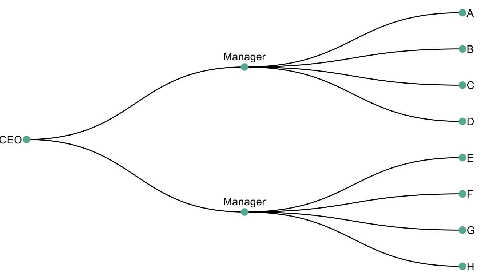

# Dendrogram

## 简介

树状图（dendrogram）是一种网状结构。它包含一个根节点（root-node），延伸出多个子节点，接点之间通过 edges 或 branches 连接。层级结构末端成为叶节点（leaves）。

如下图所示：

- CEO 为 root-node
- A-H 为叶节点（leaf-node）

## 参考

- https://www.data-to-viz.com/graph/dendrogram.html