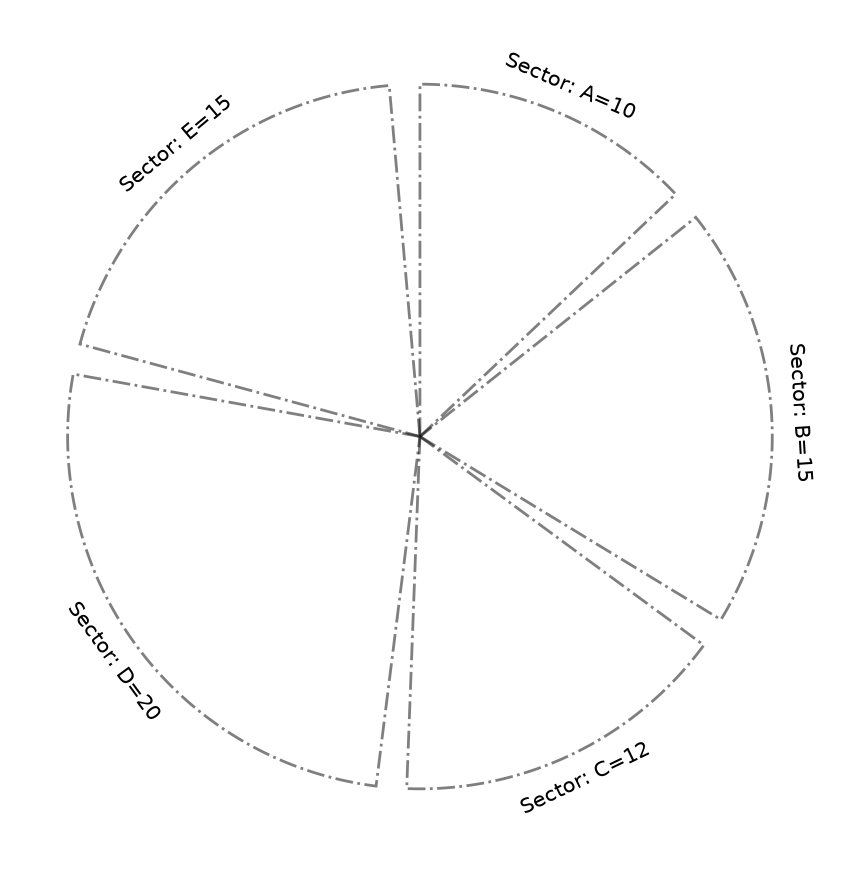
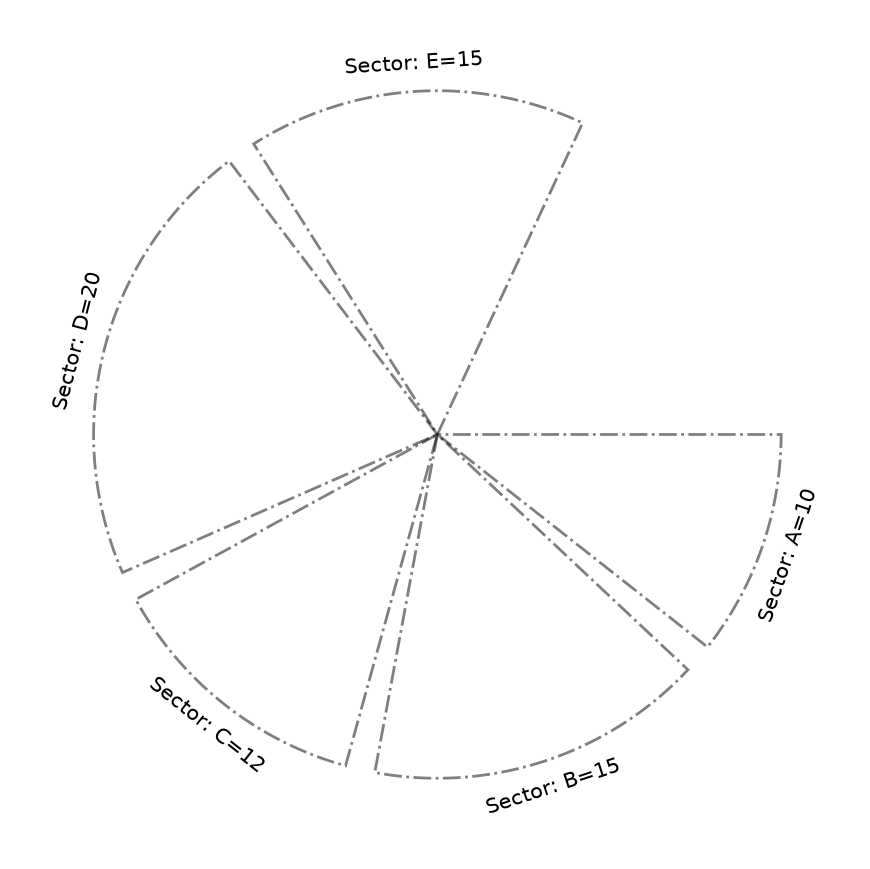
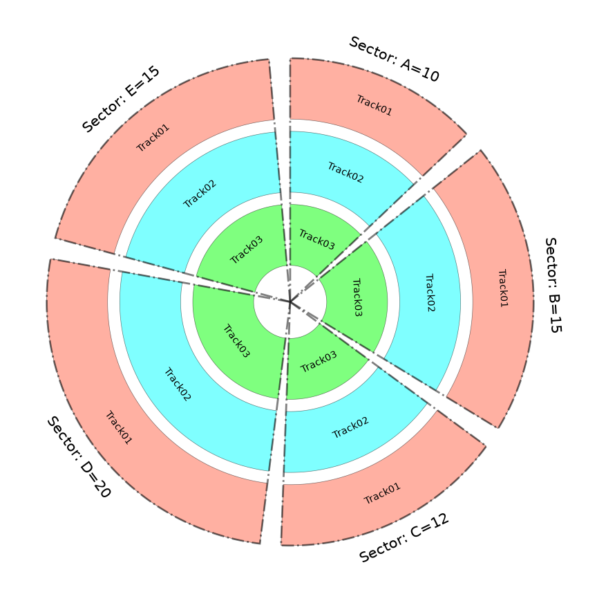
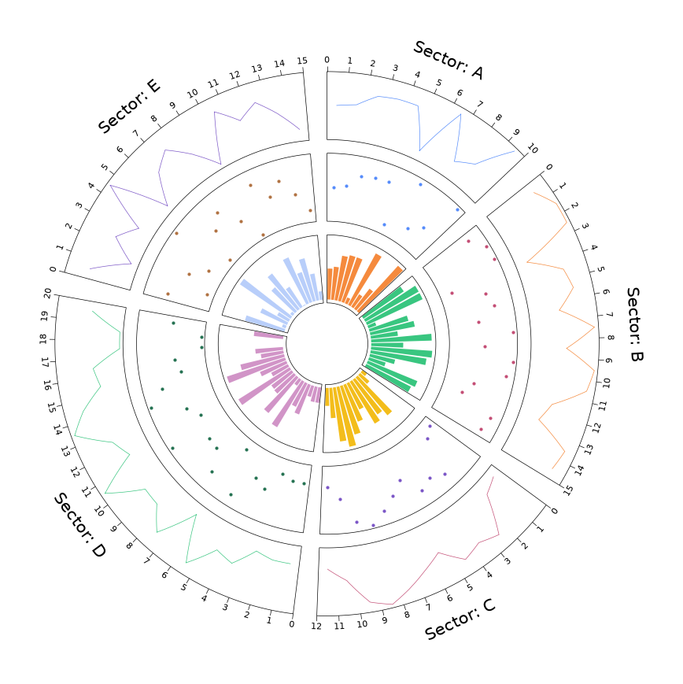
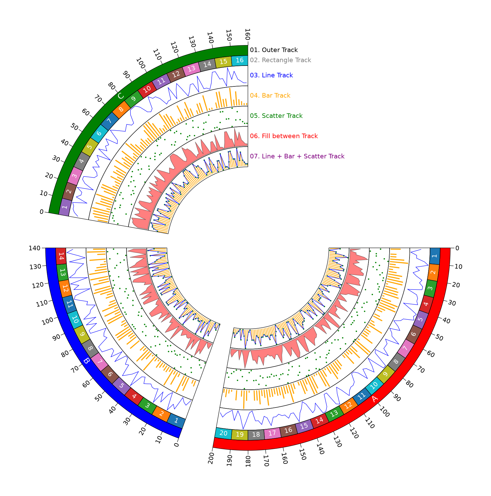
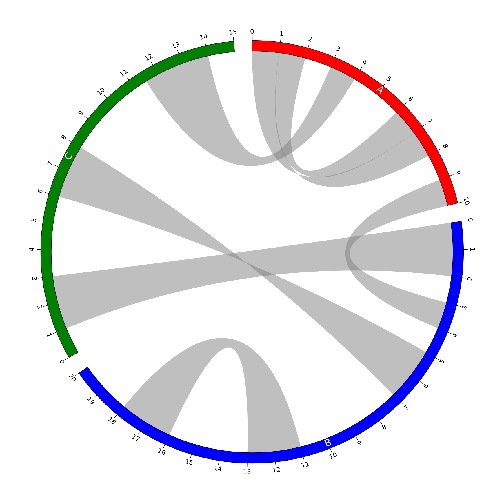
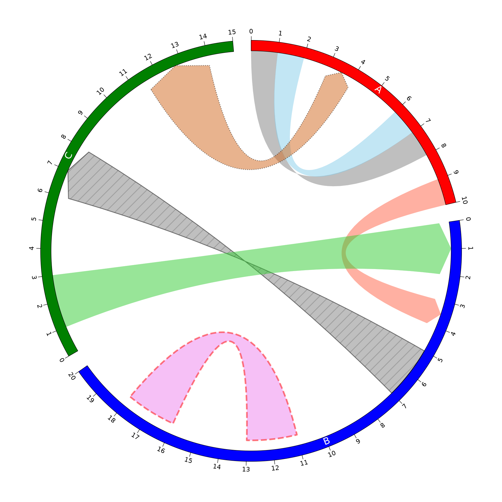
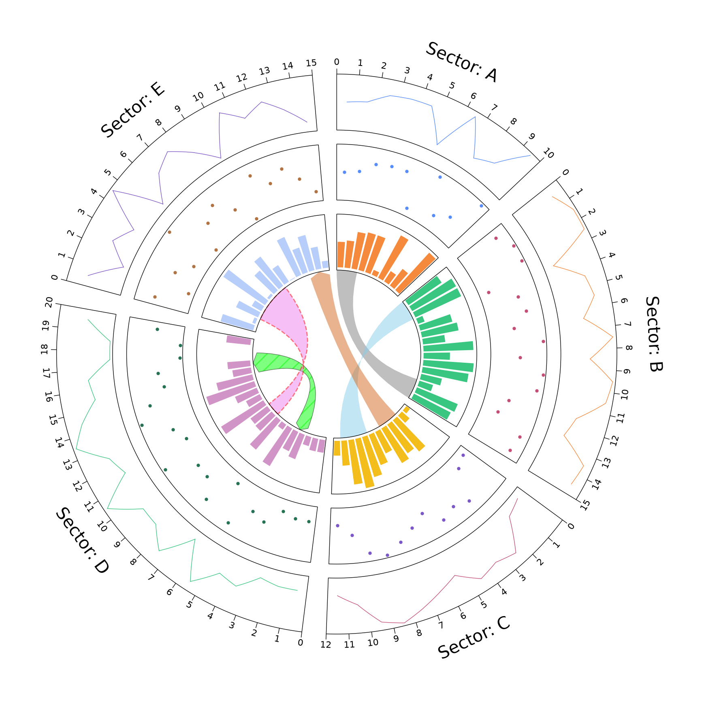

# pyCirclize 入门

@since 2026-09-10⭐
@author Jiawei Mao
***
## 1. 环形布局设计

受 R 语言 `circlize` 包的启发，`pyCirclize` 采用了由“扇区（Sectors）”和“轨道（Tracks）”组成的环形布局设计。您可以为每个扇区分配不同类型的数据，并且可以在扇区内自由放置多个轨道以进行数据绘制。

### 1.1 设置扇区

在环形布局中设置扇区时，需要提供每组数据的大小，同时还可以设置扇区之间的间隔大小。

例如，如果各扇区的数据大小为 A=10、B=15、C=12、D=20、E=15，且扇区之间的间隔为 5 度，可以使用以下代码进行设置。

```python
from pycirclize import Circos

# 初始化 circos 扇区：扇区名词以及扇区大小（所占角度比例）
sectors = {"A": 10, "B": 15, "C": 12, "D": 20, "E": 15}
circos = Circos(sectors, space=5)  # 扇区之间的间隔为 5°

#  遍历每个扇区
for sector in circos.sectors:
    # 绘制扇区的坐标轴和文本
    sector.axis(fc="none", ls="dashdot", lw=2, ec="black", alpha=0.5)
    # 文本标签：扇区名词+大小，字体大小 15
    sector.text(f"Sector: {sector.name}={sector.size}", size=15)

fig = circos.plotfig()
```



根据每个扇区的数据大小以及扇区之间的间隔大小，系统会设置合适的环形布局，如上图所示。

此外，用户可以在 -360 到 360 的范围内，自由设置环形布局的起始和结束角度。以下代码展示了将起始角度（start）设为 -270、结束角度（end）设为 30 的示例。

```python
from pycirclize import Circos

# 初始化 circos 扇区
sectors = {"A": 10, "B": 15, "C": 12, "D": 20, "E": 15}
circos = Circos(sectors, space=5, start=-270, end=30)  # Set start-end degree ranges

for sector in circos.sectors:
    # Plot sector axis & name text
    sector.axis(fc="none", ls="dashdot", lw=2, ec="black", alpha=0.5)
    sector.text(f"Sector: {sector.name}={sector.size}", size=15)

fig = circos.plotfig()
```



### 1.2 设置轨道（Tracks）

用户可以在扇区半径范围（0 - 100）内自由放置轨道。以下代码展示了在每个扇区中放置 3 个轨道的示例。

```python
from pycirclize import Circos

# Initialize circos sectors
sectors = {"A": 10, "B": 15, "C": 12, "D": 20, "E": 15}
circos = Circos(sectors, space=5)

for sector in circos.sectors:
    # Plot sector axis & name text
    sector.axis(fc="none", ls="dashdot", lw=2, ec="black", alpha=0.5)
    sector.text(f"Sector: {sector.name}={sector.size}", size=15)
    # Set Track01 (Radius: 75 - 100)
    track1 = sector.add_track((75, 100))
    track1.axis(fc="tomato", alpha=0.5) # 设置颜色和透明度
    track1.text(track1.name)
    # Set Track02 (Radius: 45 - 70)
    track2 = sector.add_track((45, 70))
    track2.axis(fc="cyan", alpha=0.5)
    track2.text(track2.name)
    # Set Track03 (Radius: 15 - 40)
    track3 = sector.add_track((15, 40))
    track3.axis(fc="lime", alpha=0.5)
    track3.text(track3.name)

fig = circos.plotfig()
```



在上述示例图中，仅展示了轨道的放置，但在实际应用中，通常会在轨道上绘制各种数值与统计数据。下一节将详细说明如何在轨道内进行数据绑定与绘图。

## 2. 在轨道上绘制数据

轨道（Track）提供了多种绘图函数。本节将展示如何在轨道上执行基础绘图操作。

您可以分别使用 `track.line()`、`track.scatter()` 和 `track.bar()` 方法来绘制折线图、散点图和柱状图。此外，还可以使用 `track.xticks_by_interval()` 方法来绘制 X 轴刻度。以下是一段示例代码。

```python
from pycirclize import Circos
import numpy as np

np.random.seed(0)

sectors = {"A": 10, "B": 15, "C": 12, "D": 20, "E": 15}
circos = Circos(sectors, space=5)
for sector in circos.sectors:
    # 设置扇区名词 r=110 代表文本距离圆心的半径，size=15 为字体大小
    sector.text(f"Sector: {sector.name}", r=110, size=15)
    # 为数据绘图创建 x 轴位置（从扇区起点到终点）及随机生成的 y 轴数值
    x = np.arange(sector.start, sector.end) + 0.5
    y = np.random.randint(0, 100, len(x))
    # 绘制折线图 (Line)
    # 添加一个轨道，半径范围为 75 到 100，轨道间距比例为 0.1
    line_track = sector.add_track((75, 100), r_pad_ratio=0.1)
    line_track.axis() # 绘制轨道轴线
    line_track.xticks_by_interval(1) # 设置 X 轴刻度间隔为 1
    line_track.line(x, y) # 在轨道上绘制折线图
    # 绘制散点图 (Points)
    # 添加第二个轨道，半径范围为 45 到 70
    points_track = sector.add_track((45, 70), r_pad_ratio=0.1)
    points_track.axis() # 绘制轨道轴线
    points_track.scatter(x, y) # 在轨道上绘制散点图
    # 绘制柱状图 (Bar)
    # 添加第三个轨道，半径范围为 15 到 40
    bar_track = sector.add_track((15, 40), r_pad_ratio=0.1)
    bar_track.axis()
    bar_track.bar(x, y)

fig = circos.plotfig()
```



用户还可以按照以下方式，在更复杂的环形布局中绘制更多数据。

```python
from pycirclize import Circos
from pycirclize.utils import ColorCycler
import numpy as np

np.random.seed(0)
# 设置颜色循环器使用的调色板为 "tab10"
ColorCycler.set_cmap("tab10")

# 定义各个扇区（sectors）的名称及其大小
sectors = {"A": 200, "B": 140, "C": 160}
# 为每个扇区指定专属颜色
sector_colors = {"A": "red", "B": "blue", "C": "green"}
# 创建 Circos 对象，设置扇区间隔为 10，起始角度为 90 度，结束角度为 360 度，且末尾不留空白
circos = Circos(sectors, space=10, start=90, end=360, endspace=False)

# 遍历 Circos 对象中的每一个扇区
for sector in circos.sectors:
    # === 1. 外部轨道 (Outer Track) ===
    outer_track = sector.add_track((95, 100))
    outer_track.text(sector.name, color="white") # 在轨道上显示扇区名称
    outer_track.axis(fc=sector_colors[sector.name]) # 绘制轨道轴线，填充色为扇区专属颜色
    outer_track.xticks_by_interval(interval=10, label_orientation="vertical") # 设置刻度间隔为 10，标签垂直显示

    # === 2. 矩形轨道 (Rectangle Track) ===
    rect_track = sector.add_track((90, 95))
    rect_size = 10 # 每个矩形的宽度
    # 循环绘制矩形块
    for i in range(int(rect_track.size / rect_size)):
        x1, x2 = i * rect_size, i * rect_size + rect_size
         # 绘制矩形，设置边框为黑色、线宽 0.5，颜色由 ColorCycler 自动分配
        rect_track.rect(x1, x2, ec="black", lw=0.5, color=ColorCycler())
         # 绘制矩形，设置边框为黑色、线宽 0.5，颜色由 ColorCycler 自动分配
        rect_track.text(str(i + 1), (x1 + x2) / 2, size=8, color="white")

    # === 准备绘图数据 ===
    # 生成随机 x, y 绘图数据（x 为从 1 到扇区大小的奇数序列，y 为 0-9 的随机整数）
    x = np.arange(1, int(sector.size), 2)
    y = np.random.randint(0, 10, len(x))

    # === 3. 折线轨道 (Line Track) ===
    line_track = sector.add_track((80, 90), r_pad_ratio=0.1)
    line_track.axis()
    line_track.line(x, y, color="blue")
    # Scatter Track
    scatter_track = sector.add_track((70, 80), r_pad_ratio=0.1)
    scatter_track.axis()
    scatter_track.bar(x, y, width=0.8, color="orange")
    # Bar Track
    bar_track = sector.add_track((60, 70), r_pad_ratio=0.1)
    bar_track.axis()
    bar_track.scatter(x, y, color="green", s=3)
    # Fill Track
    fill_track = sector.add_track((50, 60), r_pad_ratio=0.1)
    fill_track.axis()
    fill_track.fill_between(x, y, y2=0, fc="red", ec="black", lw=0.5, alpha=0.5)
    # Line + Bar + Scatter Track
    line_bar_scatter_track = sector.add_track((40, 50), r_pad_ratio=0.1)
    line_bar_scatter_track.axis()
    line_bar_scatter_track.line(x, y, color="blue")
    line_bar_scatter_track.bar(x, y, width=0.8, color="orange")
    line_bar_scatter_track.scatter(x, y, color="green", s=3)

# Plot text description
text_common_kws = dict(ha="left", va="center", size=8)
circos.text(" 01. Outer Track", r=97.5, color="black", **text_common_kws)
circos.text(" 02. Rectangle Track", r=92.5, color="grey", **text_common_kws)
circos.text(" 03. Line Track", r=85, color="blue", **text_common_kws)
circos.text(" 04. Bar Track", r=75, color="orange", **text_common_kws)
circos.text(" 05. Scatter Track", r=65, color="green", **text_common_kws)
circos.text(" 06. Fill between Track", r=55, color="red", **text_common_kws)
circos.text(" 07. Line + Bar + Scatter Track", r=45, color="purple", **text_common_kws)

fig = circos.plotfig()
```



## 3. 绘制连接线（Plot Link）

`pyCirclize` 实现了在扇区内部或扇区之间绘制数据连接线的功能。该功能使用户能够直观地展示数据间的网络、流向等相互关系。

```python
from pycirclize import Circos

sectors = {"A": 10, "B": 20, "C": 15}
name2color = {"A": "red", "B": "blue", "C": "green"}
circos = Circos(sectors, space=5)
for sector in circos.sectors:
    track = sector.add_track((95, 100))
    track.axis(fc=name2color[sector.name])
    track.text(sector.name, color="white", size=12)
    track.xticks_by_interval(1)

# Plot links
circos.link(("A", 0, 1), ("A", 7, 8))
circos.link(("A", 1, 2), ("A", 7, 6))
circos.link(("A", 9, 10), ("B", 4, 3))
circos.link(("B", 5, 7), ("C", 6, 8))
circos.link(("B", 18, 16), ("B", 11, 13))
circos.link(("C", 1, 3), ("B", 2, 0))
circos.link(("C", 11.5, 14), ("A", 4, 3))

fig = circos.plotfig()
```



用户可以自由设置每条连接线的绘图样式，例如颜色、纹理和方向。

```python
from pycirclize import Circos

sectors = {"A": 10, "B": 20, "C": 15}
name2color = {"A": "red", "B": "blue", "C": "green"}
circos = Circos(sectors, space=5)
for sector in circos.sectors:
    track = sector.add_track((95, 100))
    track.axis(fc=name2color[sector.name])
    track.text(sector.name, color="white", size=12)
    track.xticks_by_interval(1)

# Plot links with various styles
circos.link(("A", 0, 1), ("A", 7, 8))
circos.link(("A", 1, 2), ("A", 7, 6), color="skyblue")
circos.link(("A", 9, 10), ("B", 4, 3), direction=1, color="tomato")
circos.link(("B", 5, 7), ("C", 6, 8), direction=1, ec="black", lw=1, hatch="//")
circos.link(("B", 18, 16), ("B", 11, 13), r1=90, r2=90, color="violet", ec="red", lw=2, ls="dashed")
circos.link(("C", 1, 3), ("B", 2, 0), direction=1, color="limegreen")
circos.link(("C", 11.5, 14), ("A", 4, 3), direction=2, color="chocolate", ec="black", lw=1, ls="dotted")

fig = circos.plotfig()
```



当然，也可以将轨道上的数据图与连接线图（link plots）结合起来进行绘制。

```python
from pycirclize import Circos
import numpy as np
np.random.seed(0)

# Initialize Circos sectors
sectors = {"A": 10, "B": 15, "C": 12, "D": 20, "E": 15}
circos = Circos(sectors, space=5)

for sector in circos.sectors:
    # Plot sector name
    sector.text(f"Sector: {sector.name}", r=110, size=15)
    # Create x positions & randomized y values
    x = np.arange(sector.start, sector.end) + 0.5
    y = np.random.randint(0, 100, len(x))
    # Plot line track
    line_track = sector.add_track((80, 100), r_pad_ratio=0.1)
    line_track.xticks_by_interval(interval=1)
    line_track.axis()
    line_track.line(x, y)
    # Plot points track
    points_track = sector.add_track((55, 75), r_pad_ratio=0.1)
    points_track.axis()
    points_track.scatter(x, y)
    # Plot bar track
    bar_track = sector.add_track((30, 50), r_pad_ratio=0.1)
    bar_track.axis()
    bar_track.bar(x, y)

# Plot links
circos.link(("A", 0, 3), ("B", 15, 12))
circos.link(("B", 0, 3), ("C", 7, 11), color="skyblue")
circos.link(("C", 2, 5), ("E", 15, 12), color="chocolate", direction=1)
circos.link(("D", 3, 5), ("D", 18, 15), color="lime", ec="black", lw=0.5, hatch="//", direction=2)
circos.link(("D", 8, 10), ("E", 2, 8), color="violet", ec="red", lw=1.0, ls="dashed")

fig = circos.plotfig()
```




