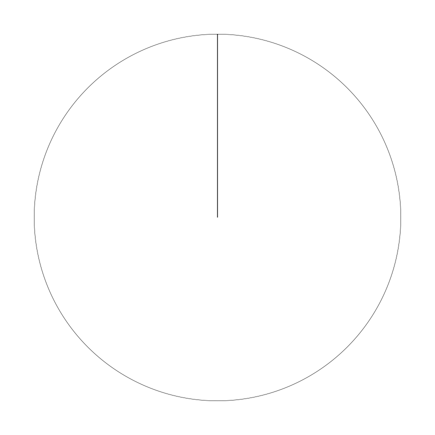
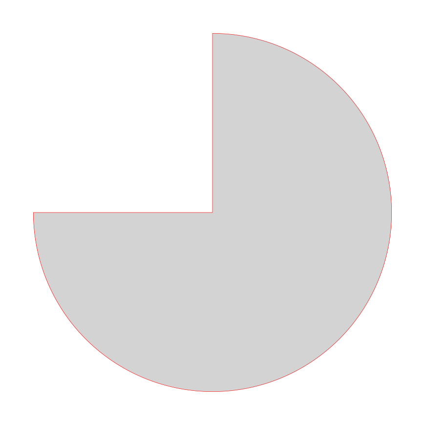
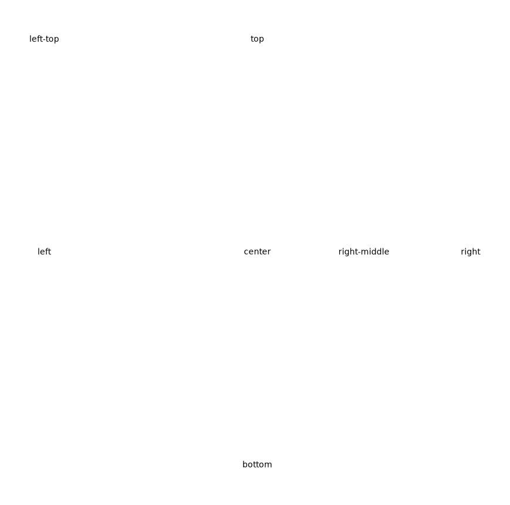
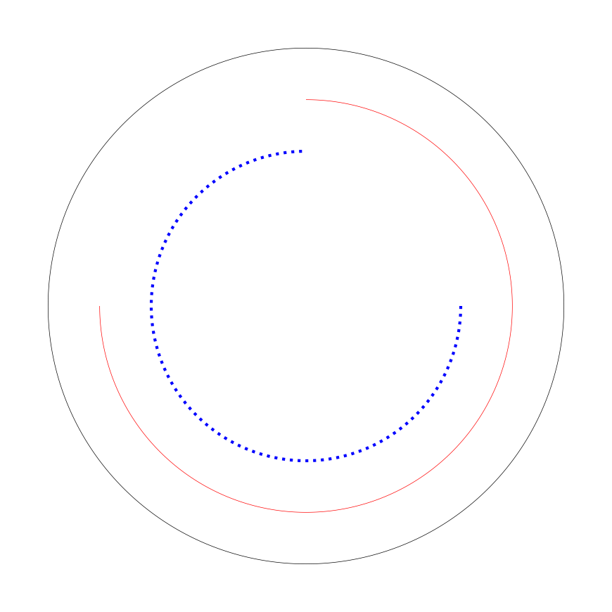

# pyCirclize API


## 1. Circos Class

### 1.1 axis

```python
from pycirclize import Circos

sectors = {"A": 10, "B": 20, "C": 15} # 值定义每个扇区的相对大小
circos = Circos(sectors, space=5) # space 为角度
circos.axis() # 为每个扇区添加坐标轴，默认绘制在扇区外侧（沿圆周的弧形坐标轴）
fig = circos.plotfig() # 渲染图形，返回 Matplotlib 的 Figure 对象
# 在脚本中，需要调用 fig.savefig() 保存，或用 plt.show() 显示。
```



```python
from pycirclize import Circos

sectors = {"A": 10, "B": 20, "C": 15}
circos = Circos(sectors, end=270, space=5) # 总范围 270°（包括空白）
circos.axis(fc="lightgrey", ec="red") # 定义坐标轴颜色
fig = circos.plotfig()
```

> [!NOTE]
>
> - pyCirclize 的 0° 位于顶部（12 点方向）
> - 角度按顺时针增加



### 1.2 text

```python
from pycirclize import Circos
import math

sectors = {"A": 10, "B": 20, "C": 15}
circos = Circos(sectors, space=5)
circos.text("center") # 放在圆心
circos.text("top", r=100) # 半径 r=100(刚好在圆周上），角度默认 deg=0
circos.text("right", r=100, deg=90) # 圆周上，三点钟方向
circos.text("right-middle", r=50, deg=90) # 圆周一半，三点钟方向
circos.text("bottom", r=100, deg=180) # 圆周上，六点钟方向
circos.text("left", r=100, deg=270) # 圆周上，九点钟方向
circos.text("left-top", r=100 * math.sqrt(2), deg=315) # 半径大概 141.4
fig = circos.plotfig()
```

> [!TIP]
>
> pyCirclize 通过半径 `r` 和角度 `deg` 定义文本位置。



### 1.3 line

```python
from pycirclize import Circos

sectors = {"A": 10, "B": 20, "C": 15}
circos = Circos(sectors, space=5)
circos.line(r=100) # 在半径 r=100 画一个完整的圆，默认黑色实线
# 在半径 r=80 角度范围 (0,270) 画红色弧线
circos.line(r=80, deg_lim=(0, 270), color="red") 
# 在半径 r=60 角度范围 (90,360) 画蓝色虚线
circos.line(r=60, deg_lim=(90, 360), color="blue", lw=3, ls="dotted")
fig = circos.plotfig()
```

> [!NOTE]
>
> `circos.line()` 在极坐标下按指定半径和角度画弧线。



## 2. Sector Class


## 3. Track Class

