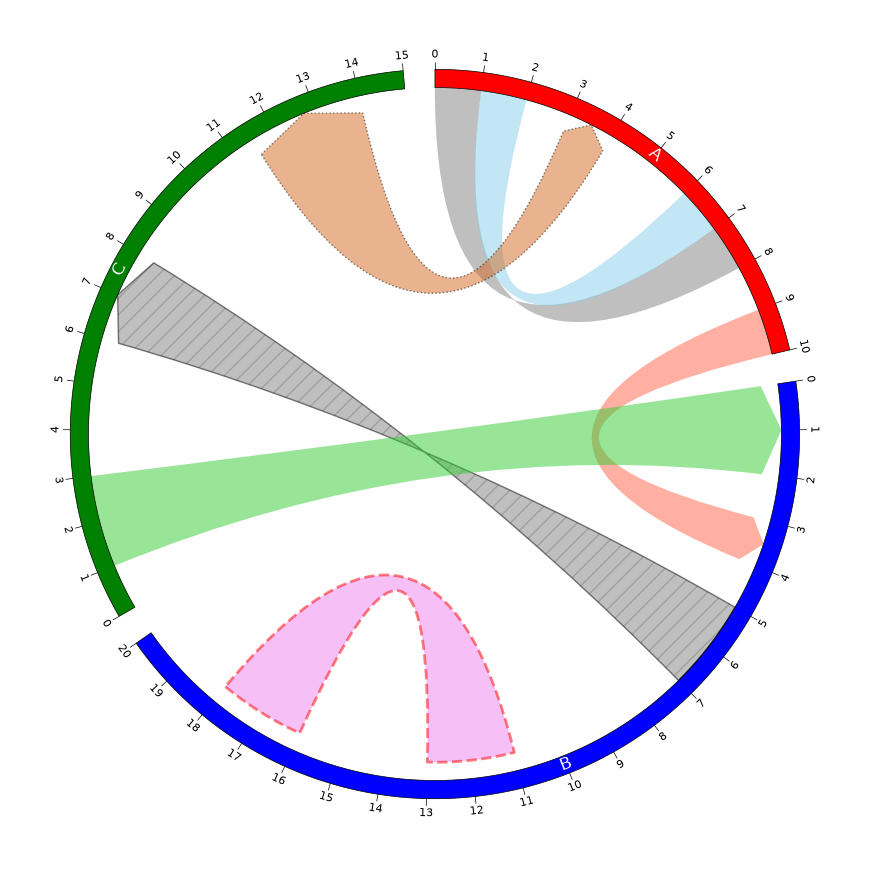

# pyCirclize API


## 1. Circos Class

### 1.1 axis

```python
from pycirclize import Circos

sectors = {"A": 10, "B": 20, "C": 15} # 值定义每个扇区的相对大小
circos = Circos(sectors, space=5) # space 为角度
circos.axis() # 为每个扇区添加坐标轴，默认绘制在扇区外侧（沿圆周的弧形坐标轴）
fig = circos.plotfig() # 渲染图形，返回 Matplotlib 的 Figure 对象
# 在脚本中，需要调用 fig.savefig() 保存，或用 plt.show() 显示。
```


```python
from pycirclize import Circos

sectors = {"A": 10, "B": 20, "C": 15}
circos = Circos(sectors, end=270, space=5) # 总范围 270°（包括空白）
circos.axis(fc="lightgrey", ec="red") # 定义坐标轴颜色
fig = circos.plotfig()
```

> [!NOTE]
>
> - pyCirclize 的 0° 位于顶部（12 点方向）
> - 角度按顺时针增加


### 1.2 text

```python
from pycirclize import Circos
import math

sectors = {"A": 10, "B": 20, "C": 15}
circos = Circos(sectors, space=5)
circos.text("center") # 放在圆心
circos.text("top", r=100) # 半径 r=100(刚好在圆周上），角度默认 deg=0
circos.text("right", r=100, deg=90) # 圆周上，三点钟方向
circos.text("right-middle", r=50, deg=90) # 圆周一半，三点钟方向
circos.text("bottom", r=100, deg=180) # 圆周上，六点钟方向
circos.text("left", r=100, deg=270) # 圆周上，九点钟方向
circos.text("left-top", r=100 * math.sqrt(2), deg=315) # 半径大概 141.4
fig = circos.plotfig()
```

> [!TIP]
>
> pyCirclize 通过半径 `r` 和角度 `deg` 定义文本位置。


### 1.3 line

```python
from pycirclize import Circos

sectors = {"A": 10, "B": 20, "C": 15}
circos = Circos(sectors, space=5)

# 在半径 r=100 画一个完整的圆，默认黑色实线
circos.line(r=100) 

# 在半径 r=80 角度范围 (0,270) 画红色弧线
circos.line(r=80, deg_lim=(0, 270), color="red") 

# 在半径 r=60 角度范围 (90,360) 画蓝色虚线
circos.line(r=60, deg_lim=(90, 360), color="blue", lw=3, ls="dotted")

fig = circos.plotfig()
```

> [!NOTE]
>
> `circos.line()` 在极坐标下按指定半径和角度画弧线。


### 1.4 rect

`circos.rect()` 在极坐标下按指定的半径范围和角度范围绘制环形扇区。参数：

- `r_lim`: 半径范围，tuple 类型，`(内半径，外半径)`
- `deg_lim`：角度范围，tuple 类型，`(起始角度，终止角度)`，默认 `(0,360)`
- `fc`：填充色（face color）
- `ec`：边框色（edge color）
- `lw` ：线宽（line width）
- `hatch`：填充图案
- `alpha`：透明度

```python
from pycirclize import Circos

# 三个扇区，间隔 5°, 扇区划分只是初始化 Circos
sectors = {"A": 10, "B": 20, "C": 15}
circos = Circos(sectors, space=5)

# rect() 在全局极坐标绘制，不依赖扇区划分
# 在半径 80-100 之间画一个完整的环带，默认样式
circos.rect(r_lim=(80, 100))

# 在半径 60-80 之间画一段环带，角度范围 0-270，颜色 tomoto (番茄红)
circos.rect(r_lim=(60, 80), deg_lim=(0, 270), fc="tomato")

# 在半径 30-50 之间画一段环带，角度范围 90-360，颜色 lime (亮绿），边框灰色，线宽 2，填充图案为斜线
circos.rect(r_lim=(30, 50), deg_lim=(90, 360), fc="lime", ec="grey", lw=2, hatch="//")

# 在半径 30-100 之间画一段环带，角度范围 0-90，因此会覆盖之前部分区域，填充 orange，透明度 0.2
circos.rect(r_lim=(30, 100), deg_lim=(0, 90), fc="orange", alpha=0.2)
fig = circos.plotfig()
```


> [!TIP]
>
> `circos.rect()` 通常用于绘制热图轨道，背景色块、区间标记等。与 `circos.line()` 类似，它是全局极坐标绘制，不依赖扇区定义。
>
> 多次调用 `rect()` 可以叠加环带，后画的会覆盖先画的（除非设置透明度）。

### 1.5 link

```python
from pycirclize import Circos

# 定义三个扇区
sectors = {"A": 10, "B": 20, "C": 15}
# 定义每个扇区的颜色
name2color = {"A": "red", "B": "blue", "C": "green"}
circos = Circos(sectors, space=5)

# 遍历每个扇区
for sector in circos.sectors:
    # 在半径 95-100 之间添加一条轨道（外圈细环）
    track = sector.add_track((95, 100))
    # 为轨道绘制坐标轴，填充色为扇区对应的颜色
    track.axis(fc=name2color[sector.name])
    # 在轨道中央写扇区名词，白色，字号 12
    track.text(sector.name, color="white", size=12)
    # 每隔 1 个单位绘制一个刻度，用于指定轨道内位置
    track.xticks_by_interval(1)
# 此时所有扇区外圈形成一个带颜色、名词和刻度的环带
    
# Plot links in various styles
circos.link(("A", 0, 1), ("A", 7, 8))
circos.link(("A", 1, 2), ("A", 7, 6), color="skyblue")
circos.link(("A", 9, 10), ("B", 4, 3), direction=1, color="tomato")
circos.link(("B", 5, 7), ("C", 6, 8), direction=1, ec="black", lw=1, hatch="//")
circos.link(("B", 18, 16), ("B", 11, 13), r1=90, r2=90, color="violet", ec="red", lw=2, ls="dashed")
circos.link(("C", 1, 3), ("B", 2, 0), direction=1, color="limegreen")
circos.link(("C", 11.5, 14), ("A", 4, 3), direction=2, color="chocolate", ec="black", lw=1, ls="dotted")

fig = circos.plotfig()
```



### 1.6 link_line

## 2. Sector Class


## 3. Track Class

